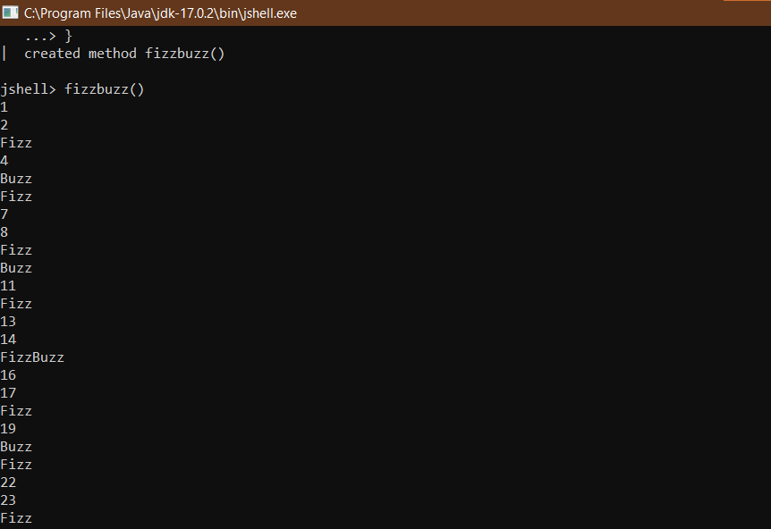

# Making FizzBuzz in Java 

Hello everyone! In this article I’m going to show you how to make a function that does fizzbuzz using Java!

Java is a programming language which is commonly used in the Cloud. The first edition of Minecraft was written in Java [1]. In addition, it is widely used in Android [2].

First, you will need to download Java, you can find it [here](https://www.oracle.com/java/technologies/downloads/). Then, you install it to some location for example your “Program Files” or Desktop. Once you are done go to the place where you installed it, in the folder bin, and run” jshell.exe”. This will start JShell! JShell is a command line environment where you can run and execute Java code.

First let’s enable printing functions (like print, printf, etc.) by entering the following Jshell command:

```
/open PRINTING
```

At this point, we are ready to write the fizzbuzz function.

The first line of code you will type into JShell will be this:

```
void fizzbuzz() {
```

This will create a function called fizzbuzz. The parentheses are for arguments, but we don’t have any so you shouldn’t worry about them. The curled bracket is to open our function and there we will put the body.

Now type this on a new line:

```
	for(int c=1; c<=100; c=c+1) { 
```

This will create a for loop. A for loop does something over and over again. You can decide how many times it does something by writing it in the expression in the arguments. For for loop, the first argument will be creating a variable, c, which stands for counter, and deciding what starting value is going to be in it (in our case it is 1). The second argument is an expression, to decide how many times the for loop is going to run itself. Finally, the third argument is to decide how many numbers it will level up after each run of the for loop.

Now inside for loop put the following:

```
		if(c%3==0) {
			print("Fizz");
		}
```

Every time the for loop runs, it will execute the if condition. The if condition checks whether the current value in c is divisible by 3 (using modulo operation) and if it does it prints ‘fizz’.

```
		if(c%5==0) {
			print("Buzz");
		}
```
	
These will be your next lines in the body of for loop. This is another if condition, but now it checks whether c is divisible by 5 (using the modulo operation again). If it is divisible by 5, it will print ‘buzz’.

Now we check for non Fizz Buzz numbers:

```
		if(c%3!=0&&c%5!=0) {
			print(c);
		}
```
	
This is yet another if condition, but now it checks if c is not divisible by 3 and 5. The exclamation point and the equal sign mean not equal and the && mean and. If c isn’t divisible by 3 or 5, it will print c (since it is not a fizz, buzz or fizzbuzz number).

This will be your final line in your for loop and function:

```
		print("\n");
	}
}
```

This line will print a new line at the end of each run of the for loop. You need this line because you want to see all numbers on a separate line.

Now to run your function, type “fizzbuzz()” into Jshell and you should see something like this:



To save your function, you could type it into notepad++, a programming space. You can download that [here](https://notepad-plus-plus.org/downloads/).


References:

[1](https://www.redbull.com/se-en/history-of-minecraft#:~:text=The%20first%20edition%20of%20Minecraft%2C%20called%20Java%20Edition%2C,to%2C%20which%20nowadays%20is%20called%2C%20the%20Classic%20version.) 

[2](https://www.geeksforgeeks.org/top-programming-languages-for-android-app-development/)
